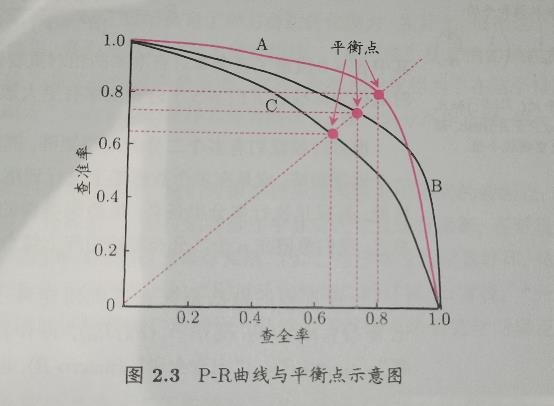
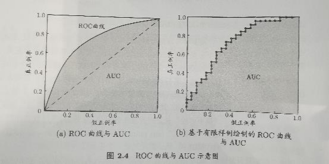
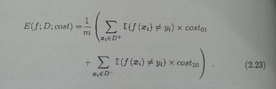
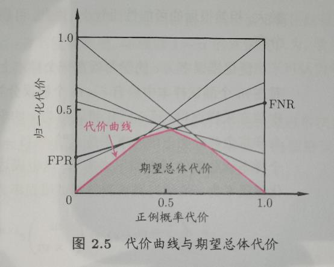

# **2.1 经验误差与过拟合**
**过拟合**：将训练样本自身的一些特点当作了潜在样本都具有的一般性质，导致泛化能力下降。

**欠拟合**：对训练样本的一般性质尚未学好。
# **2.2 评估方法**
通常通过测试集来对学习器的泛化误差进行评估。
## **2.2.1 留出法**
将数据集划分为两个**互斥**的集合（注意保持**一致性**），作为训练集和测试集。即使给定了训练/测试样本比例，仍存在多种留出方案，因此单次留出法往往是不可靠的，使用留出法时往往要采用**若干次随机划分**、重复进行实验评估后取**平均值**作为留出法的评估结果。例如进行100次随机划分，每次产生一个训练/测试集用于实验评估，100次后得到100个结果，而留出法返回的是这100个结果的平均。

留出法存在一个窘境：训练集大则评估不准；测试集大则训练效果不好。
## **2.2.2 交叉验证法**
先将数据集D划分为**k个大小相似的互斥子集**，每个子集尽可能保持数据一致性（分层采样得到各个子集）。之后每次使用k-1个子集的并集作为训练集，余下的那个子集作为测试集。以上述方式可以进行k次训练和测试，最终返回以上k轮的测试结果的均值。与留出法类似，在划分子集时有多种划分方法，因此使用时要随即使用不同的划分方法重复p次，最终的评估结果是这p次k折交叉验证结果的平均值。

特例：**留一法**——测试集仅有一个样本。训练结果较准确，但是复杂度高，当数据集过大训练较慢。
## **2.2.3 自助法（不常用）**
自主采样，最终约1/3的数据永远不会被采样到，因此天然的划分了测试集和训练集。
# **2.3 性能度量**
回归任务最常用的性能度量：**均方误差**
$$
E(f;D)=\frac{1}{m}\sum_{i=1}^m(f(x_i)-y_i)^2
$$

## **2.3.1 错误率与精度**
**错误率**：分类错误的样本数占样本总数的比例。

**精度**：分类正确的样本数占总样本数的比例。
## **2.3.2 查准率、查全率和F1**
对于二分类问题，可根据其真实类别和学习器预测类别的组合分为**真正例（true positive）**、**假正例（false positive）**、**真反例（true negative）**、**假反例（false negative）**。

**查准率定义**：正例中有多少真正例（正例的检测准确率）

$$
P=\frac{TP}{TP+FP}
$$
**查全率定义**：所有真例中有多少被认为是正例（正例找的全不全）
$$
R=\frac{TP}{TP+FN}
$$

P-R图直观体现了学习器在样本总体上的查全率、查准率。若一个学习器的PR曲线完全被另一个学习器的**包住**，则可以断言**后者的性能优于前者**（如图中，A优于C）。

平衡点（BEP）：查准率=查全率时的取值。用来大致衡量两个学习器的性能优劣。

F1：一种比BEP更精确的度量方式。
$$
F_1=\frac{2\times P\times R}{P+R}=\frac{2\times TP}{样例总数+TP-TN}
$$
更一般的形式：

$$
F_\beta=\frac{(1+\beta^2)\times P\times R}{(\beta^2\times P)+R}
$$
其中，β>0度量了查准率对查全率的相对重要性。β=1时退化为F1，β>1时查全率有更大影响；β<1时查准率有更大影响。

有时我们有多个二分类混淆矩阵，比如进行了多次训练/测试，每次得到一个混淆矩阵；或是在多个数据集上进行训练/测试，希望估计学习器的“全局”性能……**希望获得n个二分类混淆矩阵上的综合查准率和查全率**。

**计算方法一：求各个混淆矩阵上查准率和查全率的平均值。**

宏查准率（macro-P）：

$$
macro-P=\frac{1}{n}\sum_{i=1}^nP_i
$$
宏查全率（macro-R）：

$$
macro-R=\frac{1}{n}\sum_{i=1}^nR_i
$$
宏F1（macro-F1）：

$$
macro-F_1=\frac{2\times macro-P\times macro-R}{macro-P+macro-R}
$$
**计算方法二：根据TP、FP、TN、FN的平均值计算。**

微查准率（micro-P）：

$$
micro-P=\frac{\overline{TP}}{\overline{TP}+\overline{FP}}
$$
微查全率（micro-R）：

$$
micro-R=\frac{\overline{TP}}{\overline{TP}+\overline{FN}}
$$
微F1（micro-F1）：

$$
micro-F_1=\frac{2\times micro-P\times micro-R}{micro-P+micro-R}
$$

## **2.3.3 ROC与AUC**
ROC（受试者工作特征）：根据学习器的预测结果把样例进行**排序**，按此顺序**逐个把样本作为正例进行预测**，每次计算出两个重要量的值作为横纵坐标。

纵轴：**真正例率（TPR）**；横轴：**假正例率（FPR）**。

$$
TPR=\frac{TP}{TP+FN}
$$

$$
FPR=\frac{FP}{TN+FP}
$$

与PR图类似，若某学习器的ROC曲线包住了其他学习器的ROC曲线，则称前者的性能优于后者。

AUC：ROC曲线下的面积。

## **2.3.4 代价敏感错误率与代价曲线**
以二分类为例，定义代价矩阵，costij表示将第i类样本预测为第j类样本的代价。一般来说，costii=0。

代价敏感错误率表示如下：详见P36

在非等价条件下前述ROC曲线不能直接反映学习器的期望总体代价，而代价曲线可以达到该目的。

代价曲线的**横轴**是取值[0, 1]的**正例概率代价**

其中p是样例为正例的概率。

**纵轴**是取值为[0, 1]的**归一化代价**。

其中FPR是假正例率，FNR是假反例率，FNR=1-FPR。

曲线绘制过程：**ROC曲线上的每一个点对应了代价平面上的一条线段**。设ROC曲线上有一点(FPR, TPR)，则可以相应计算出FNR，然后在代价平面上绘制线段从(0, FPR)到(1, FNR)，线段下的面积代表了该条件下期望的总体代价。绘制完所有线段后取下界，**下界下的面积即为在所有条件下学习器的期望总体代价**。

# **2.4 比较检验**
**比较学习器性能面临的问题**：

1：希望得到泛化的性能，但是实际得到的是测试集上的性能，两者未必一样。

2：测试集上的性能会随着测试集的规模，内容的变化而变化。

3：很多机器学习算法本身具有随机性，使用相同的参数在同一个测试集上多次运行会得到不同的结果。

**主流解决方案**：统计假设检验
## **2.4.1 假设检验**
原理介绍，P37~40，以下是具体的检验方法。
## **2.4.2 交叉验证t检验P40~41**
假设比较两个学习器A和B的性能，在k折的每一折上求两者的错误率之差，计算差值的均值μ和方差σ2，计算变量并与临界值tα2，k-1比较，小于则认为二者性能无显著差别。

## **2.4.3 McNemar检验P41**
## **2.4.4 Friedman检验和Nemenyi后续检验**
前两种方法限于在一个数据集上评价两种算法，但是存在一个数据集上一次性评价多个算法的需求。
# **2.5 偏差与方差**
泛化误差可分解为偏差、方差与噪声之和。

