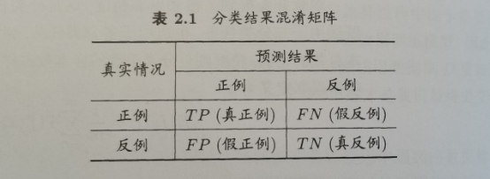

## **2.3.2 查准率、查全率和F1**
对于二分类问题，可根据其真实类别和学习器预测类别的组合分为**真正例（true positive）**、**假正例（false positive）**、**真反例（true negative）**、**假反例（false negative）**。

**查准率定义**：正例中有多少真正例（正例的检测准确率）

P=TPTP+FP

**查全率定义**：所有真例中有多少被认为是正例（正例找的全不全）

R=TPTP+FN

理解：

情景假设：有10个西瓜，有8个好瓜，2个坏瓜。

情景1(0,1)：

全部认为是坏瓜， TP=0，FN=8，FP=0，TN=2。

P=0/0 à 1；R=0/8=0。

情景2(0.125,1)：

认为有1个好瓜，9个坏瓜，其中判断是好瓜的瓜确实是好瓜，TP=1，FN=7，FP=0，TN=2。

P=1/(1+0)=1；R=1/(1+7)=1/8。

情景3(0.5,0.8)：

认为有5个好瓜，5个坏瓜，其中认为是好瓜的有一个坏瓜，认为是坏瓜的有四个好瓜。

TP=4，FN=4，FP=1，TN=1。

P=4/(4+1)=0.8；R=4/(4+4)=0.5。

情景4(0.625,0.714)：

认为有7个好瓜，3个坏瓜，其中认为是好瓜的有两个坏瓜，认为是坏瓜的有三个好瓜。

TP=5，FN=3，FP=2，TN=0。

P=5/(5+2)=5/7=0.714；R=5/(5+3)=0.625。

**\*\***情景6(1,0.8) **\*\***：

全部认为是好瓜，TP=8，FN=0，FP=2，TN=0。

P=8/(8+2)=0.8，R=8/8=1

**注意**，PR曲线基本不会收敛到点(1,0)，当R=1，P的取值应与数据集中正反例的比例有关。

